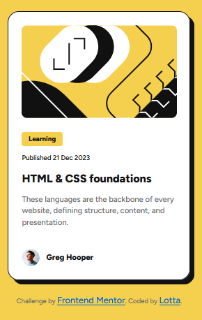

# Frontend Mentor - Blog preview card solution

This is a solution to the [Blog preview card challenge on Frontend Mentor](https://www.frontendmentor.io/challenges/blog-preview-card-ckPaj01IcS). Frontend Mentor challenges help you improve your coding skills by building realistic projects. 

## Table of contents

- [Overview](#overview)
  - [The challenge](#the-challenge)
  - [Screenshot](#screenshot)
- [My process](#my-process)
  - [Built with](#built-with)
  - [What I learned](#what-i-learned)
  - [Continued development](#continued-development)
  - [Useful resources](#useful-resources)


## Overview

### The challenge

Users should be able to:

- See hover and focus states for all interactive elements on the page

### Screenshot



## My process

### Built with

- Semantic HTML5 markup
- CSS custom properties
- Flexbox
- Mobile-first workflow

### What I learned

During this challenge I learned:
1. How to look sizing and other detail information in Figma.
2. I became more comfortable with flex.
3. How to do box-shadow. I used a box-shadow generator to help with the correct numbers.

```css
.card{
box-shadow: 8px 8px 0px 0px var(--color-gray-950);
}
```

### Continued development

I am not sure if it is "good HTML" to mark first a H2-tag, then a p-tag and then H1-tag. I don't know if that matters, but feels wrong. In the future I will learn more about accessibility.

### Useful resources

- [CSS Box Shadow Generator](https://www.cssmatic.com/box-shadow) - This helped me with the box-shadow. I really liked how easy this was to use.

